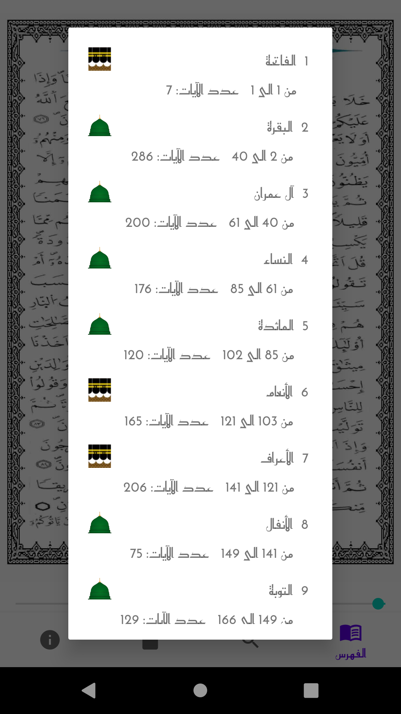
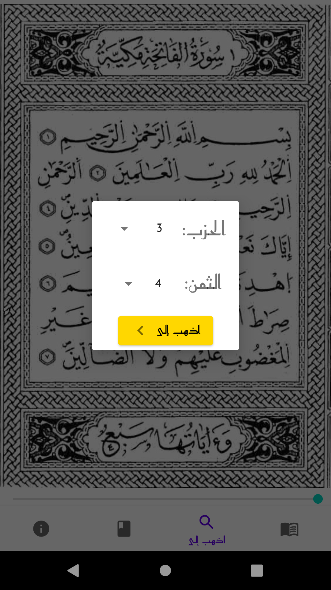
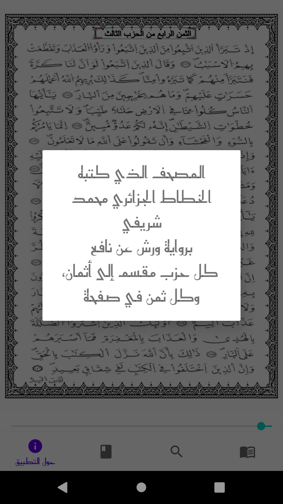
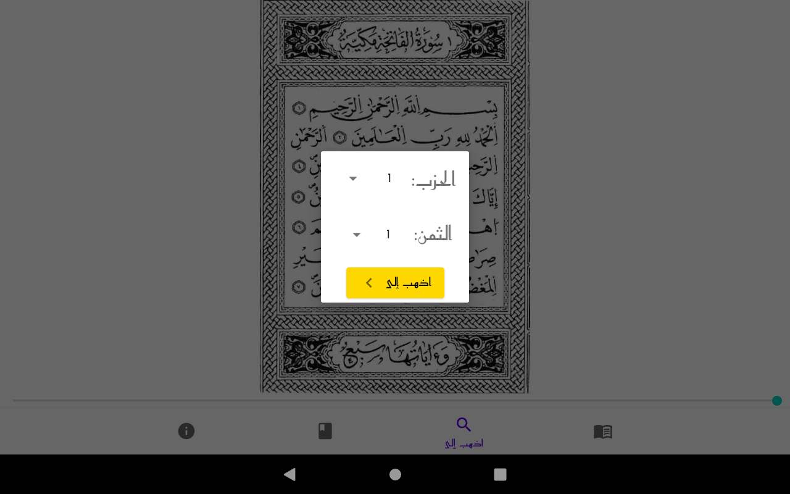
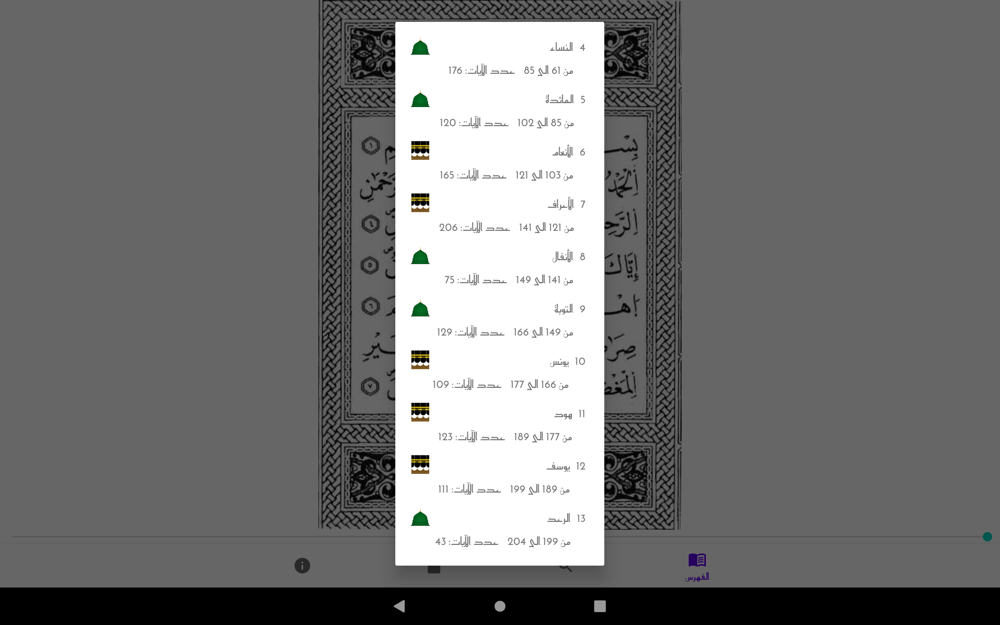

<h1 align="center">(Thomn) ثُمن</h1>

    
  </a>

Thomn is an Android application that allows users to read and navigate the Holy Quran on their mobile devices. The app features two main functions: Index and Goto.

## Features

### Index feature

The Index feature allows users to quickly jump from one surah to another. The surahs are listed in the order they appear in the Quran, making it easy to find and select the desired surah.

### Goto Feature

The Goto feature allows users to find a specific 'hizb' or 'thomn' within the Quran. Simply select the desired 'hizb' or 'thomn' from the dropdown, and the app will take you directly to the corresponding page.

## Mushaf of the application

The used mushaf in this application is the **Chadli** mushaf of algeria.

This mushaf is divided into 60 **'hizb's** and every 'hizb' is divided into 8 **'thomn's** to help its users to memorize it. 

## Screenshots

On Phone: 

On Tablet:

## Installation

To install QuranApp, follow these steps:

1. Clone the repository to your local machine.
2. Open the project in Android Studio.
3. Build and run the app on your Android device or emulator.

## Usage

To use QuranApp, simply launch the app and select the desired surah from the Index, or select the 'hizb' or 'thomn' you wish to find in the Goto Popup. The app will take you directly to the corresponding page.

## Contributing

If you'd like to contribute to QuranApp, please follow these steps:

1. Fork the repository.
2. Create a new branch for your changes.
3. Make your changes and commit them.
4. Push your changes to your fork.
5. Submit a pull request to the main repository.

## TODO

Add the memorize feature ('hifz') to the application.

# Reach us on Fiverr & Upwork

# Donations

If you found QuranApp useful, please consider making a donation to support its ongoing development. Your contribution will help ensure that we can continue to provide updates and improvements to the app.

Developer paypal email: <leo.phibonacci@gmail.com>

Thank you for your support!

